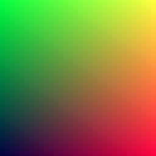
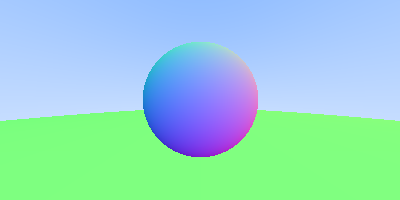

# RayTracingInOneWeekend

Python implementation of [Ray Tracing in One Weekend](https://raytracing.github.io/books/RayTracingInOneWeekend.html)

### Step 1: Output PPM Image

Output RGB values to ppm image

### Step 2: Vec3 class 

Create vec3 class 

### Step 3: Create Ray Class 

Create Ray class and send rays into the scene 

### Step 4: Create Sphere 

Add sphere to the scene 

## Step 5: Surface Normals and Multiple objects

Add shading using with surface normals and handle multiple objects

